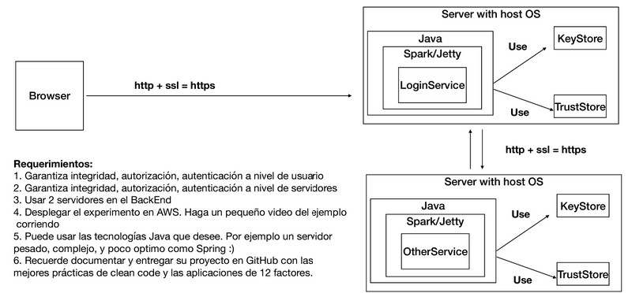

# Aplicación distribuida segura en todos sus frentes


Desarrolle una aplicación Web segura con los siguientes requerimientos:

1. Debe permitir un acceso seguro desde el browser a la aplicación. Es decir debe garantizar autenticación, autorización e integridad de usuarios.
2. Debe tener al menos dos computadores comunicacndose entre ellos y el acceso de servicios remotos debe garantizar: autenticación, autorización e integridad entre los servicios. Nadie puede invocar los servicios si no está autorizado.

3. Explique como escalaría su arquitectura de seguridad para incorporar nuevos servicios.

## Entregables:

1. Código en github, bien documentado.
2. Informe que describe la arquitectura de seguridad de su prototipo. (en el README)
3. Video de experimento en AWS


## Ayudas:

https://github.com/tipsy/spark-ssl

https://www.baeldung.com/spring-boot-https-self-signed-certificate

https://docs.oracle.com/cd/E19798-01/821-1841/gjrgy/

https://docs.oracle.com/cd/E19509-01/820-3503/ggfen/index.html

https://aws.amazon.com/es/serverless/build-a-web-app/


## Arquitectura propuesta




## **Prerrequisitos**

-   [Git](https://git-scm.com/downloads) - Sistema de control de versiones
-   [Maven](https://maven.apache.org/download.cgi) - Gestor de dependencias
-   [Java 8](https://www.java.com/download/ie_manual.jsp) - Entorno de desarrollo
-   [Intellij Idea](https://www.jetbrains.com/es-es/idea/download/) (Opcional)

## **Instrucciones de ejecución local**

0. Desde cmd clonar el repositorio

```git
https://github.com/Rincon10/AREP-LAB03.git
```

1. Ubicarse en la carpeta AREP-LAB03 y borraremos todas las dependencias y modulos que puedan exisitir de los binarios del proyecto, ademas realizamos la compilación y empaquetamiento del proyecto, con el comando.
```
mvn clean install
```

2. Ahora procederemos a iniciar el servidor HelloServer

## Para Unix
```
java -cp "target/classes:target/dependency/*" edu.escuelaing.arep.server.HelloServer
```
## Para Windows
```
java -cp "target/classes;target/dependency/*" edu.escuelaing.arep.server.HelloServer
```

3. Ejecutamos el proyecto
```maven
mvn exec:java -Dexec.mainClass="edu.escuelaing.arep.App"
```