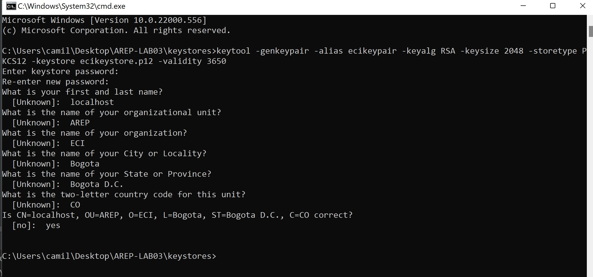
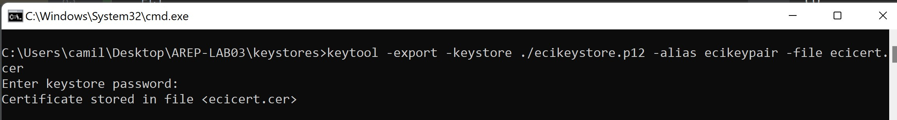
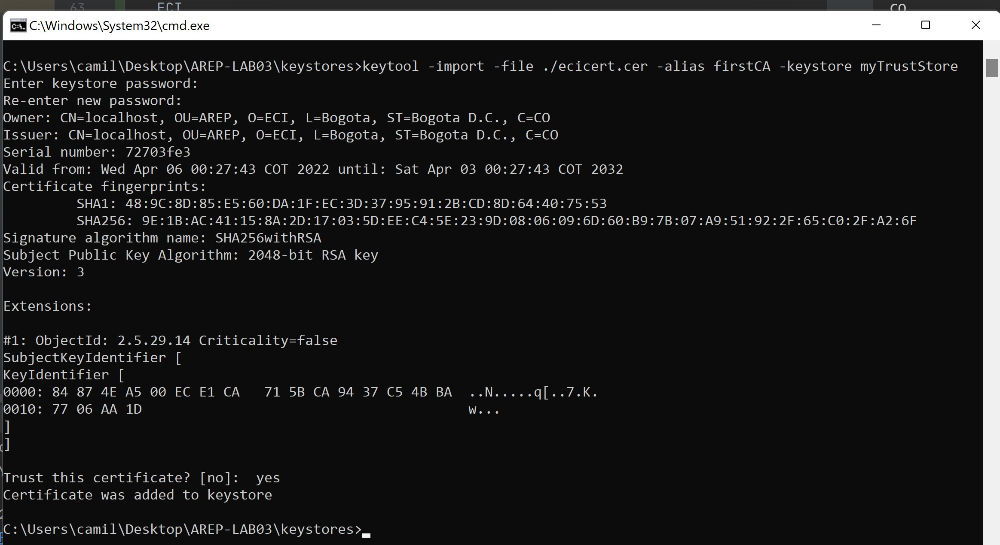
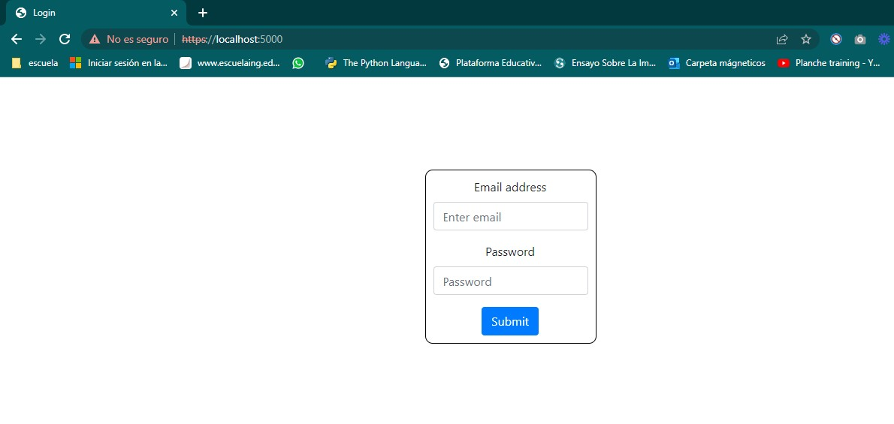
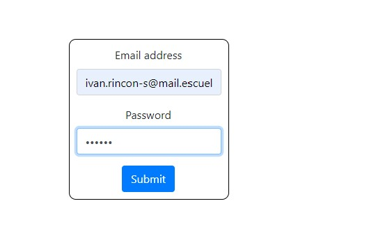
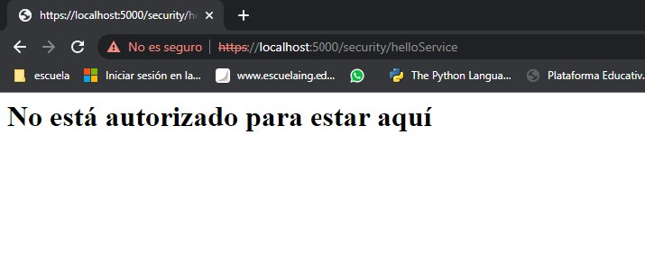
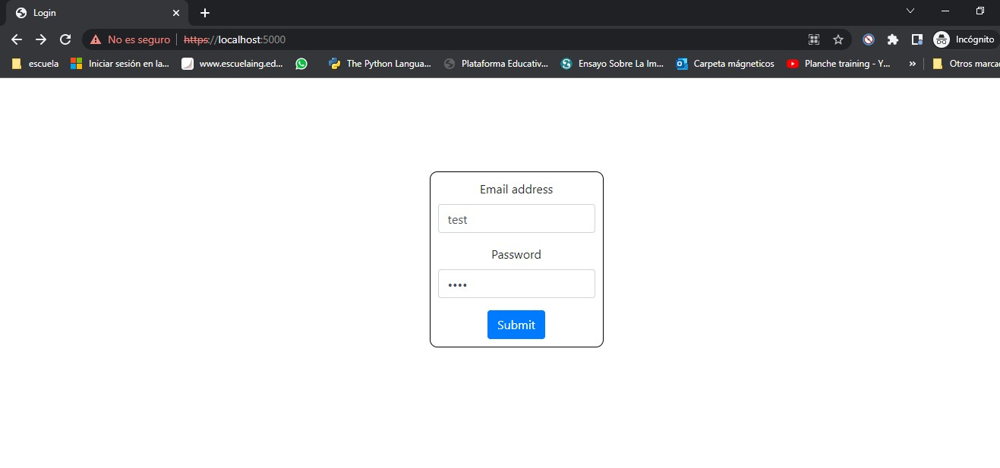

# Aplicación distribuida segura en todos sus frentes


Desarrolle una aplicación Web segura con los siguientes requerimientos:

1. Debe permitir un acceso seguro desde el browser a la aplicación. Es decir debe garantizar autenticación, autorización e integridad de usuarios.
2. Debe tener al menos dos computadores comunicacndose entre ellos y el acceso de servicios remotos debe garantizar: autenticación, autorización e integridad entre los servicios. Nadie puede invocar los servicios si no está autorizado.

3. Explique como escalaría su arquitectura de seguridad para incorporar nuevos servicios.

## Entregables:

1. Código en github, bien documentado.
2. Informe que describe la arquitectura de seguridad de su prototipo. (en el README)
3. Video de experimento en AWS


## Ayudas:

https://github.com/tipsy/spark-ssl

https://www.baeldung.com/spring-boot-https-self-signed-certificate

https://docs.oracle.com/cd/E19798-01/821-1841/gjrgy/

https://docs.oracle.com/cd/E19509-01/820-3503/ggfen/index.html

https://aws.amazon.com/es/serverless/build-a-web-app/


## Arquitectura propuesta


## **Prerrequisitos**

-   [Git](https://git-scm.com/downloads) - Sistema de control de versiones
-   [Maven](https://maven.apache.org/download.cgi) - Gestor de dependencias
-   [Java 8](https://www.java.com/download/ie_manual.jsp) - Entorno de desarrollo
-   [Intellij Idea](https://www.jetbrains.com/es-es/idea/download/) (Opcional)

## Configuracion ralizada para los certificados


Para la generacion de certificados, se utilizo la siguiente contraseña
```java
public class Password {
    public static String keyStorePassword = "123456";
}
```

1. Se creo una carpeta llamada keystores en la raiz del proyecto
2. Se genero un certificado digital con el siguiente comando

    ```
    keytool -genkeypair -alias ecikeypair -keyalg RSA -keysize 2048 -storetype PKCS12 -keystore ecikeystore.p12 -validity 3650
    ```
   Se debe de llenar con la siguiente informacion( de manera local)
   ```
   localhost-> aqui debe ir el nombre del servidor
   AREP
   ECI
   Bogota
   Bogota D.C.
   CO
   yes
   ```
   
   

3. Exportar el certificado a un archivo
    ```
    keytool -export -keystore ./ecikeystore.p12 -alias ecikeypair -file ecicert.cer
    ```
    

4. Ahora importaremos el certificado a un TrusStore // el cual nos dira que certificados de las entidades debemos confiar
  
    ```
    keytool -import -file ./ecicert.cer -alias firstCA -keystore myTrustStore
    ```
    
    
## **Instrucciones de ejecución local**

0. Desde cmd clonar el repositorio

    ```git
    https://github.com/Rincon10/AREP-LAB03.git
    ```

1. Ubicarse en la carpeta AREP-LAB03 y borraremos todas las dependencias y modulos que puedan exisitir de los binarios del proyecto, ademas realizamos la compilación y empaquetamiento del proyecto, con el comando.
    ```
    mvn clean install
    ```

2. Ahora procederemos a iniciar el servidor HelloServer

### Para Unix
```
java -cp "target/classes:target/dependency/*" edu.escuelaing.arep.server.HelloServer
```
### Para Windows
```
java -cp "target/classes;target/dependency/*" edu.escuelaing.arep.server.HelloServer
```

3. Ejecutamos el proyecto
```maven
mvn exec:java -Dexec.mainClass="edu.escuelaing.arep.App"
```

4. Una vez tengamos el proyecto en ejecucion, desde nuestro navegador colocaremos la ruta
```
https://localhost:5000/
```

y nos saldra la siguiente ventana



Cabe recalcar que el login solo detectara los siguientes usuarios
```java
private static void generateUsers() {
    users.put("Rincon10", hasher.hash("123456"));
    users.put("test", hasher.hash("test"));
}
```

## Usuarios no autenticados o no existentes



<br />





## Usuarios existentes y autenticados



<br />


